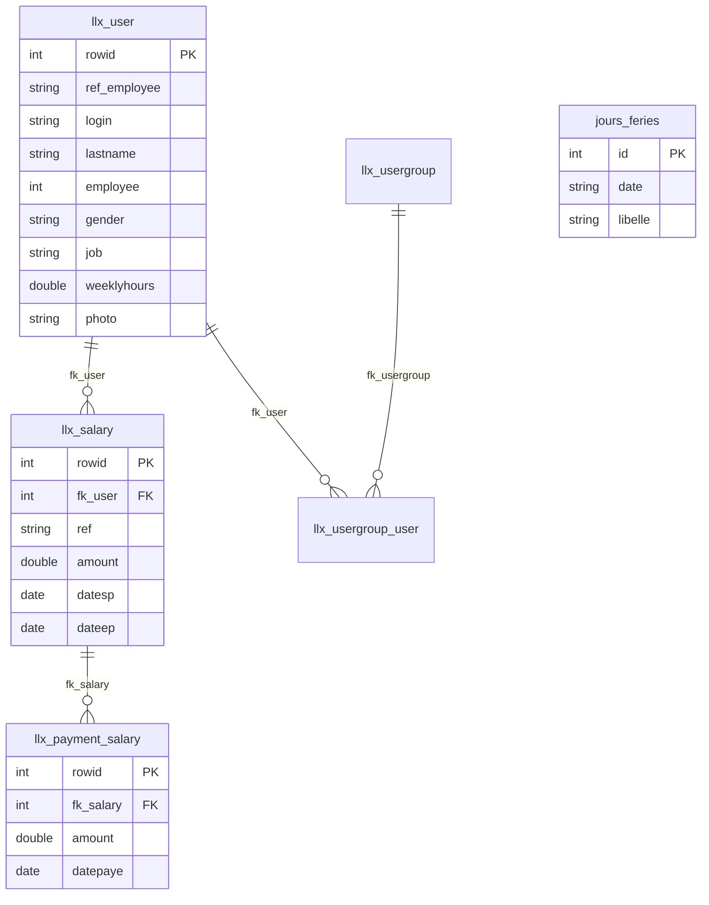

# Tables utilisées dans NewApp

Ce projet s’appuie sur **deux bases de données** et l’**API REST Dolibarr** pour accéder aux données métier.

| Stockage | Rôle |
|----------|------|
| **SQLite** (`backend/data/newapp.sqlite`) | Données propres à NewApp (jours fériés uniquement) |
| **MySQL Dolibarr** (`dolibarr`) | Données employés, salaires, paiements (ERP) |
| **API Dolibarr** | Accès principal aux employés et salaires ; complété par MySQL direct pour certaines stats et champs |

---

## 1. SQLite — base locale NewApp

Fichier : `backend/data/newapp.sqlite` (configurable via `SQLITE_PATH`).

### `jours_feries`

Créée au démarrage du backend. **Seule table SQLite du projet.**

| Colonne | Type | Description |
|---------|------|-------------|
| `id` | INTEGER | Clé primaire auto-incrémentée |
| `date` | TEXT | Date au format `YYYY-MM-DD` (unique) |
| `libelle` | TEXT | Libellé du jour férié |
| `created_at` | TEXT | Date de création |
| `updated_at` | TEXT | Date de dernière modification |

**Utilisée par :**
- `backend/src/db/sqlite.js` — création du schéma
- `backend/src/services/holidayService.js` — CRUD jours fériés
- `backend/src/routes/backoffice.js` — routes `/api/backoffice/holidays`

**Non concernée par :** import CSV employés/salaires, réinitialisation Dolibarr.

---

## 2. MySQL Dolibarr — accès direct (mysql2)

Connexion via variables `.env` : `MYSQL_HOST`, `MYSQL_USER`, `MYSQL_PASSWORD`, `MYSQL_DATABASE`.

### `llx_user`

Table principale des **utilisateurs / employés**.

| Colonne(s) utilisée(s) | Usage dans NewApp |
|------------------------|-------------------|
| `rowid` | Identifiant interne Dolibarr |
| `login` | Identifiant de connexion |
| `lastname` | Nom du salarié |
| `ref_employee` | Référence employé (CSV `ref_employe`) |
| `employee` | Flag employé (`1` = salarié) |
| `gender`, `civility` | Genre (dashboard, filtres) |
| `job` | Poste |
| `weeklyhours` | Heures travaillées par semaine |
| `photo` | Nom du fichier photo |
| `admin` | Utilisateur administrateur (conservé au reset) |

**Utilisée par :**
- `backend/src/services/mysqlUserFields.js` — lecture/écriture `weeklyhours`
- `backend/src/services/dashboardStats.js` — stats par genre (jointure avec salaires)
- `backend/src/services/zipImagesImport.js` — association photos ↔ employés
- `backend/src/services/dolibarrReset.js` — suppression des non-admin, restauration admin

**Aussi via API Dolibarr :** `/users` (import CSV employés, liste frontoffice, fiche salarié).

---

### `llx_salary`

Table des **salaires**.

| Colonne(s) utilisée(s) | Usage dans NewApp |
|------------------------|-------------------|
| `rowid` | Identifiant du salaire |
| `fk_user` | Lien vers `llx_user.rowid` |
| `ref` | Référence salaire (CSV `ref_salaire`) |
| `amount` | Montant |
| `datesp` | Date de début (stats par mois) |
| `dateep` | Date de fin |
| `label` | Libellé |

**Utilisée par :**
- `backend/src/services/dashboardStats.js` — statistiques backoffice (totaux, par genre, par mois)

**Aussi via API Dolibarr :** `/salaries` (import CSV, création, paiement, historique frontoffice).

---

### `llx_usergroup`

Groupes d’utilisateurs Dolibarr (ex. `Administrators`).

**Utilisée par :**
- `backend/src/services/dolibarrReset.js` — recréation du groupe admin si absent

---

### `llx_usergroup_user`

Liaison **utilisateur ↔ groupe**.

| Colonne(s) | Description |
|------------|-------------|
| `fk_user` | Référence `llx_user.rowid` |
| `fk_usergroup` | Référence `llx_usergroup.rowid` |
| `entity` | Entité Dolibarr |

**Utilisée par :**
- `backend/src/services/dolibarrReset.js` — rattachement de l’admin au groupe Administrators

---

## 3. MySQL Dolibarr — via API REST uniquement

Ces tables ne sont **pas interrogées en SQL direct** dans NewApp, mais sont lues/écrites via `backend/src/services/dolibarr.js` :

| Endpoint API | Table Dolibarr (équivalent) | Fonctionnalité |
|--------------|----------------------------|----------------|
| `GET/POST/PUT /users` | `llx_user` | Employés |
| `GET/POST/PUT /salaries` | `llx_salary` | Salaires |
| `GET/POST /salaries/payments` | `llx_payment_salary` | Paiements de salaire |
| `GET /bankaccounts` | `llx_bank_account` | Compte bancaire pour enregistrer les paiements |

**Services concernés :**
- `csvEmployeeImport.js` — import employés CSV
- `csvSalaryImport.js` — import salaires CSV
- `employeeService.js` — liste et recherche salariés
- `employeeSalaryHistoryService.js` — historique salaires d’un employé
- `salaryService.js` — création salaire, paiements, génération en masse

---

## 4. Tables liées aux utilisateurs (reset Dolibarr)

Lors de la **réinitialisation** (`dolibarrReset.js`), les lignes des employés supprimés sont aussi retirées de ces tables satellites :

| Table | Rôle |
|-------|------|
| `llx_user_rights` | Droits utilisateur |
| `llx_user_param` | Paramètres utilisateur |
| `llx_user_alert` | Alertes utilisateur |
| `llx_user_clicktodial` | Click-to-dial |
| `llx_user_employment` | Contrats / emploi |
| `llx_user_rib` | Coordonnées bancaires (RIB) |

---

## 5. Tables protégées lors du reset

Ces tables **ne sont jamais vidées** par NewApp :

| Table | Raison |
|-------|--------|
| `llx_const` | Configuration Dolibarr |
| `llx_usergroup` | Groupes système |
| `llx_rights_def` | Définition des droits |
| `llx_menu` | Menus |
| `llx_boxes` | Widgets dashboard |
| `llx_boxes_def` | Définition widgets |
| `llx_module` | Modules activés |
| `llx_c_*` | Dictionnaires (civilité, etc.) |
| `llx_user` | Conservée partiellement (admin uniquement) |

Toutes les autres tables `llx_*` (dont `llx_salary`, `llx_payment_salary`, etc.) sont **tronquées** lors du reset.

---

## 6. Stockage fichiers (hors tables)

| Emplacement | Contenu |
|-------------|---------|
| `DOLIBARR_USER_PHOTOS_PATH` (ex. `C:/xampp/htdocs/dolibarr/documents/users`) | Photos employés `{id}/photos/thumbs/` |

Géré par `backend/src/services/zipImagesImport.js` (import ZIP + mise à jour `llx_user.photo`).

---

## 7. Synthèse par fonctionnalité

| Fonctionnalité | Tables / stockage |
|----------------|-------------------|
| Jours fériés | SQLite `jours_feries` |
| Import employés CSV | API → `llx_user` ; MySQL → `weeklyhours` |
| Import salaires CSV | API → `llx_salary`, `llx_payment_salary` |
| Import photos ZIP | Fichiers + MySQL `llx_user.photo` |
| Liste / recherche salariés | API `llx_user` + MySQL `weeklyhours` |
| Création / paiement salaire | API `llx_salary`, `llx_payment_salary`, `llx_bank_account` |
| Dashboard backoffice | MySQL `llx_salary` + `llx_user` |
| Réinitialisation Dolibarr | MySQL — truncate `llx_*` + nettoyage `llx_user` |

---

## 8. Schéma relationnel simplifié

> **Note :** `jours_feries` est dans SQLite, indépendamment de Dolibarr.
